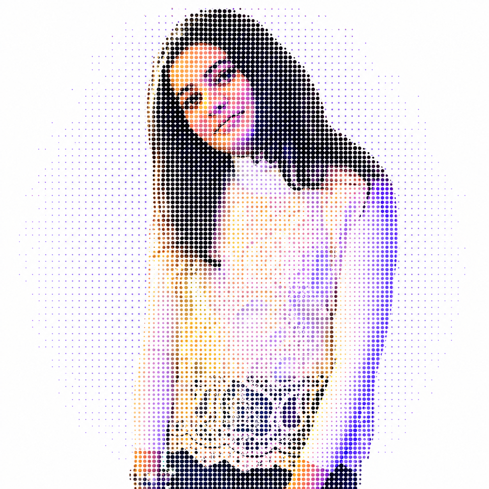
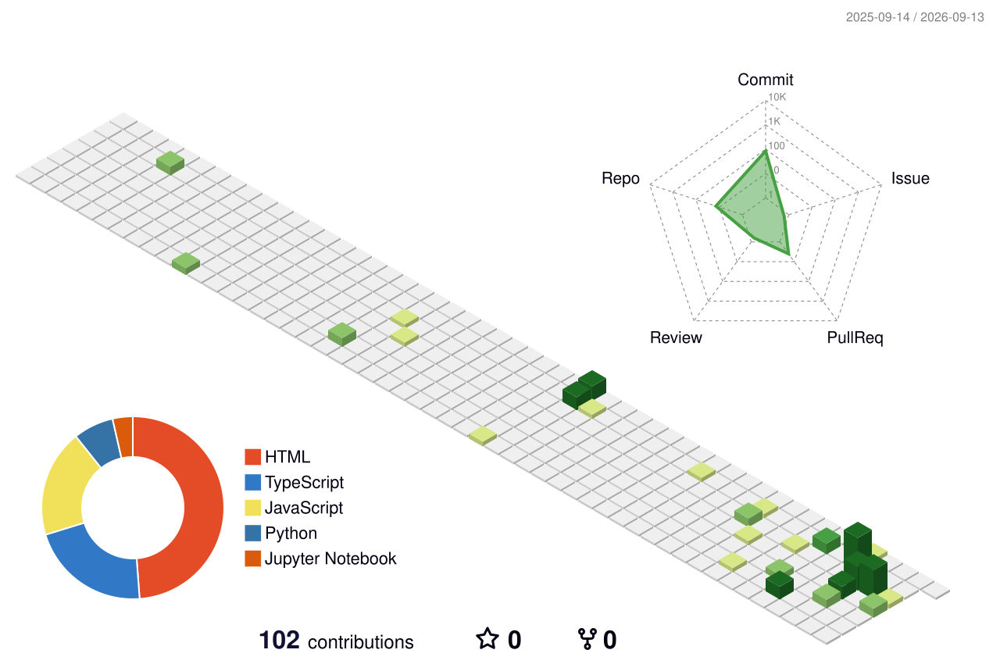

<!-- PORTRAIT -->

  

<!-- ANIMATED NAME / TAGLINE -->

 

<!-- SOCIALS -->

  

<!-- PROFILE VIEWS -->

---

<!-- 

  

  -->

---

## 👩‍💻 About Me

<table>
<tr>

<td width="58%" valign="top">

### Hey! I'm Agrima 👋

I'm a **Computer Science & AI student** who enjoys learning by building things, solving problems and experimenting with new ideas.

My coding journey started back in **Class 9 during lockdown**, when I learned **PHP and Laravel** and started exploring web development.

Since then, I've been exploring different technologies and trying to understand not just how to code, but how to actually **build useful things with code**.

 

* 🎓 Computer Science & AI Student
* ☕ Working with **Java**
* 🐍 Working with **Python**
* ⚡ Working with **JavaScript**
* ⚛️ Building with **React**
* 🌐 Exploring **Web Development**
* 🧠 Currently improving **DSA & problem solving**
* 🚀 Interested in **building real-world projects**
* 🤝 Always open to learning and collaborating

</td>

<td width="42%" align="center" valign="middle">

  

</td>

</tr>
</table>

---

# 🧭 My Coding Journey

text
                  CLASS 9
                     │
                     ▼
              PHP + Laravel 🐘
                     │
                     ▼
             Web Development 🌐
                     │
                     ▼
          Computer Science & AI 🎓
                     │
          ┌──────────┼──────────┐
          ▼          ▼          ▼
        Java ☕    Python 🐍   JavaScript ⚡
          │          │          │
          └──────────┼──────────┘
                     ▼
                  React ⚛️
                     │
                     ▼
                  DSA 🧠
                     │
                     ▼
             BUILD • SOLVE • SHIP 🚀

---

# 🛠️ Tech Stack

## 💻 Languages

## ⚛️ Frameworks & Libraries

## 🔧 Tools

---

# 🌱 Currently Learning

<table align="center">
<tr>

<td align="center" width="33%">

### 🧠 DSA

Building stronger problem-solving skills through consistent practice.

</td>

<td align="center" width="33%">

### 🌐 Full-Stack

Learning how frontend, backend, APIs and databases come together.

</td>

<td align="center" width="33%">

### 🚀 Real Projects

Moving from individual coding problems to building complete applications.

</td>

</tr>
</table>

---

# 🎯 What I'm Working Towards

### 🧠 Better Problem Solving

Learning to approach problems logically instead of memorizing solutions.

 

### 💻 Stronger Development Skills

Building projects that go beyond tutorials and actually solve problems.

 

### 🚀 Building & Shipping

Taking ideas from **"what if?" → code → working product.**

---

# 🔥 Contribution Streak

---

# 🐍 Contribution Architecture

<picture>

<source
media="(prefers-color-scheme: dark)"
srcset="https://raw.githubusercontent.com/agrima-06/agrima-06/output/github-contribution-grid-snake-dark.svg">

<source
media="(prefers-color-scheme: light)"
srcset="https://raw.githubusercontent.com/agrima-06/agrima-06/output/github-contribution-grid-snake.svg">

</picture>

  

<i>Every square is a day. Every move is progress. 🐍</i>

---

# 🧊 My Year in Code

---

# 🎥 Beyond Coding

I also enjoy **creating content and documenting my journey**.

  

  

📸 Instagram: **@klipping._.bubbles**

---

# 🌐 Let's Connect

---

  

### ✨ Learning. Building. Improving. One commit at a time.

 

And for my research, I want you to make that all the functions given in this is working. And for the transparent image part of mine, I want you to give me something cool to put it up there. Right now, I don't want to put my image in that, even though that looks pretty cool, but I don't know why you are unable to make it up. Either you make it up for me, or else leave it, or give me something very cool animation to put up there. And make sure that every function or feature is working in this.

Yes — now that I can see the exact structure you're going for, I would not use the portrait at all for now.

Instead, let's make the top feel like a developer terminal / coding animation, while keeping the rest of the profile polished. I also went through the services you're using and checked their current documentation: Typing SVG supports the animated typing effect, GitHub Readme Stats supports the stats/top-language cards, Streak Stats supports the streak card, snk supports custom Snake colors, and the 3D contribution action officially generates an animated profile-green-animate.svg.

I would also make one important change: use the generated profile-green-animate.svg rather than profile-night-green.svg. The 3D project explicitly generates both static and animated variants.

Your final README

Replace your current README with this:

<!-- ==================== HERO ANIMATION ==================== -->

  

<!-- ==================== TYPING INTRO ==================== -->

 

<!-- ==================== SOCIALS ==================== -->

  

---

# 👩‍💻 About Me

<table>
<tr>

<td width="58%" valign="top">

### Hey! I'm Agrima 👋

I'm a **Computer Science & AI student** who enjoys learning by building things, solving problems and experimenting with new ideas.

My coding journey started back in **Class 9 during lockdown**, when I learned **PHP and Laravel** and started exploring web development.

Since then, I've been exploring different technologies and trying to understand not just how to code, but how to actually **build useful things with code**.

 

- 🎓 Computer Science & AI Student
- ☕ Working with **Java**
- 🐍 Working with **Python**
- ⚡ Working with **JavaScript**
- ⚛️ Building with **React**
- 🐘 Worked with **PHP & Laravel**
- 🌐 Exploring **Web Development**
- 🧠 Improving **DSA & problem solving**
- 🚀 Interested in **building real-world projects**
- 🤝 Always open to learning and collaborating

</td>

<td width="42%" align="center" valign="middle">

  

</td>

</tr>
</table>

---

# 🧭 My Coding Journey

                    CLASS 9
                       │
                       ▼
                PHP + Laravel 🐘
                       │
                       ▼
               Web Development 🌐
                       │
                       ▼
            Computer Science & AI 🎓
                       │
            ┌──────────┼──────────┐
            ▼          ▼          ▼
          Java ☕    Python 🐍   JavaScript ⚡
            │          │          │
            └──────────┼──────────┘
                       ▼
                    React ⚛️
                       │
                       ▼
                    DSA 🧠
                       │
                       ▼
              Full-Stack Development
                       │
                       ▼
               BUILD • SOLVE • SHIP 🚀

🛠️ Tech Stack
💻 Languages

  

⚛️ Frameworks & Libraries

  

🔧 Tools

  

🌱 Currently Learning
<table align="center"> <tr> <td align="center" width="33%">
🧠 DSA

Building stronger problem-solving skills through consistent practice.

</td> <td align="center" width="33%">
🌐 Full-Stack

Learning how frontend, backend, APIs and databases come together.

</td> <td align="center" width="33%">
🚀 Real Projects

Turning ideas into complete applications instead of only following tutorials.

</td> </tr> </table>
🎯 What I'm Working Towards

🧠 Better Problem Solving

Learning to approach problems logically instead of memorizing solutions.

 
💻 Stronger Development Skills

Building projects that go beyond tutorials and actually solve problems.

 
🚀 Building & Shipping

Taking ideas from "what if?" → code → working product.

📊 GitHub Stats

🔥 Contribution Streak

🏆 GitHub Achievements

🐍 Contribution Architecture

 <picture>

<source media="(prefers-color-scheme: dark)" srcset="https://raw.githubusercontent.com/agrima-06/agrima-06/output/github-contribution-grid-snake-dark.svg">

<source media="(prefers-color-scheme: light)" srcset="https://raw.githubusercontent.com/agrima-06/agrima-06/output/github-contribution-grid-snake.svg">

</picture>

  

<i>Every square is a day. Every move is progress. 🐍</i>

🧊 My Year in Code

💻 What I Like Building
<table align="center"> <tr> <td align="center" width="33%">
🌐 Web Apps

Interactive websites and applications using modern frontend technologies.

</td> <td align="center" width="33%">
🤖 AI & Tech

Exploring how AI can be combined with software to build useful products.

</td> <td align="center" width="33%">
🚀 Ideas → Products

Taking an idea and turning it into something people can actually use.

</td> </tr> </table>
🎥 Beyond Coding

I also enjoy creating content and documenting my journey.

  

  

📸 Instagram: @bubbleiff

🌐 Let's Connect

 

  

  

  

 

  

✨ Learning. Building. Improving. One commit at a time.
 

 
